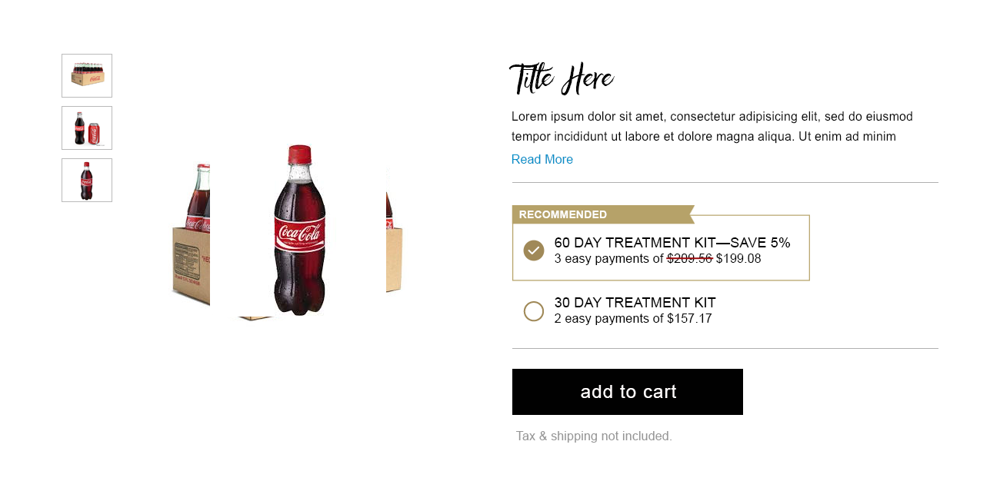
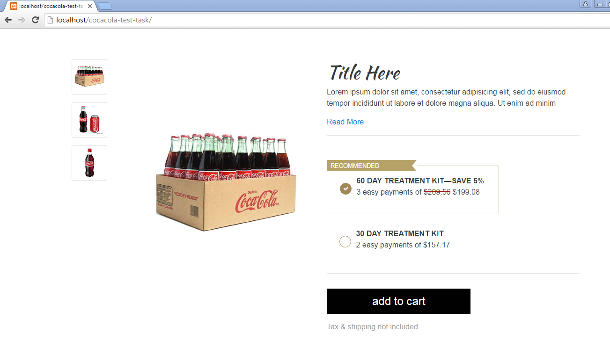
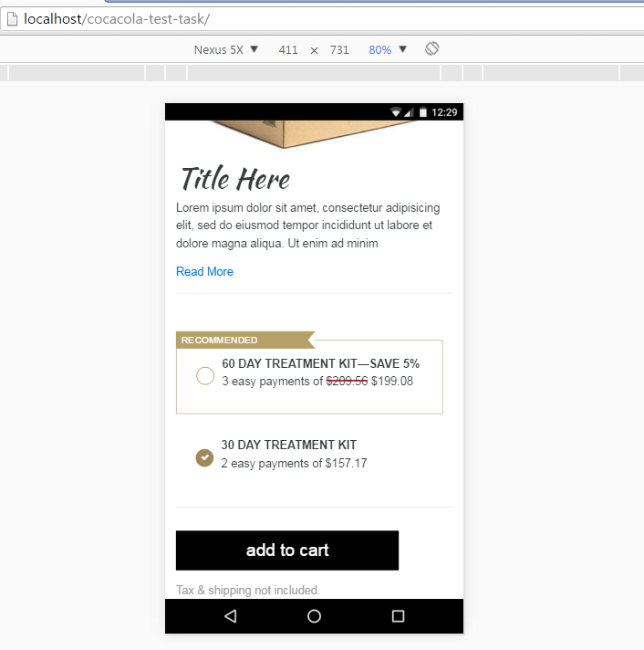
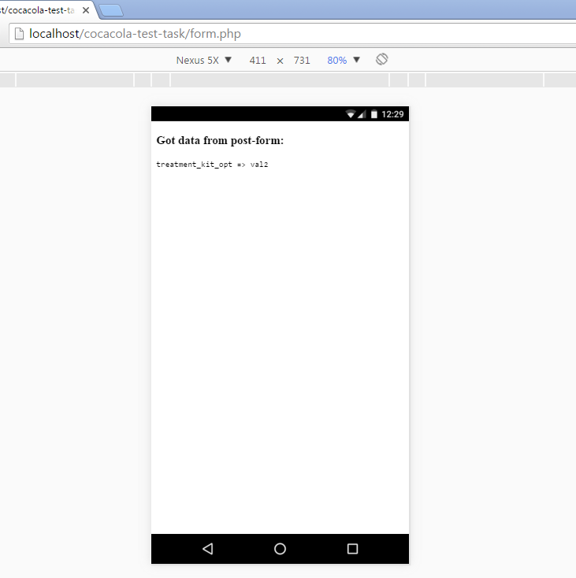
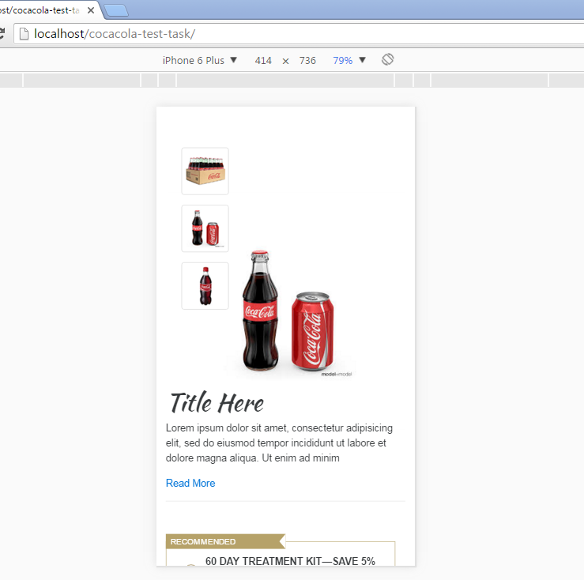

# cocacola-test-task
Test task for [upwork job](https://www.upwork.com/jobs/Front-End-Developer-HTML-CSS-Bootstrap_~01f5a21c0ce0001f89?source=rss)

## Task
> As a test, please download and convert the attached PSD into HTML.
> Applicants who do not complete this test will not be considered.
> Programming Languages Required: HTML CSS
> Skills: jQuery, Bootstrap




# Result

* Add jquery handler over thumbnail pictures to switch big picture
* Big picture switching by [jQuery Circle Tool](https://github.com/malsup/cycle2.git). For production I woud use lazy load pictures (by js), to minify page load time.
* I have no the **FaithAndGloryOne** font on my computer, so downloaded [this](https://www.google.com/fonts/specimen/Kaushan+Script) instead from google fonts.
* There is javascript-handler over "Read More" link, which will show full version of Lorem ipsum text.
* Writed simple **form.php** to handle post query from form with input switch.
* I did separate thumbnail pictures to minify page load time. But this is backend issue (php, ruby..)
* I woud use SASS here (on gulp or rails views), but there were said nothing about SASS in the task.
* There were no any criteria for adaptivity and minimum browsers version support in the task.

### Installation
To install this project locally, please clone it from github and let the [bower](http://bower.io/) install it's components:
```bash
git clone https://github.com/NataliaVolik/cocacola-test-task.git
cd cocacola-test-task/
bower install
```

### Desktop view


### Mobile view


### Got data in backend


### Mobile view

